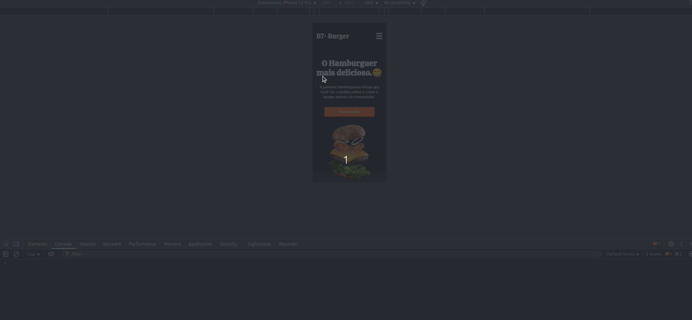

# 🍔 B7Burger - Hamburgueria Online
Projeto desenvolvido durante o curso de HTML5 e CSS3 da B7Web.

## 🔗 Demo
- **Site:** [Acesse aqui](https://b7-burger-projeto-.netlify.app)
- **Preview:**  


---

## ✅ Recursos
- Hero com chamada para ação.
- Cardápio dividido em menu.
- Hamburgueres destacados/promoção.
- Layout responsivo.

---

## 🛠 Tecnologias
- **HTML5**
- **CSS3** (Flexbox, Grid)

---

## ▶️ Rodando Localmente
```bash
# Clone este repositório
git clone https://github.com/erica-monteiro-developer/b7burger-html-css.git
cd b7burger-html-css

# Abra o arquivo principal
index.html
```
Ou use Live Server (VS Code)

---

## 👩‍💻 Autor(a)
**Érica Monteiro**
